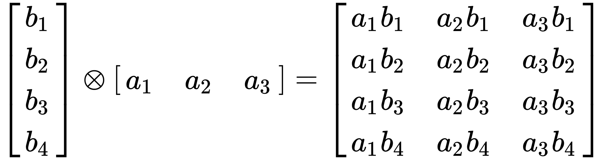

# numpy矩阵、多维数组API

> 其实`scipy.linalg`包含了numpy中的所有矩阵API，而且更多。

## 一、创建多维数组—`ndarray`对象

`ndarray`类型对象是`numpy`中的多维数组对象，具体的可以查看`numpy.ndarray`的文档。

### 1.`numpy.array()`—将列表转成`ndarray`对象

```python
a = [[x for x in range(10)] for i in range(10)]
b = numpy.array(a)
```

`numpy.array()`可以根据列表的维度转换成对应的`ndarray`对象。

### 2.`numpy.zeros(),numpy.ones(),numpy.empty(),numpy.matlib.rand()`等—创建指定大小的`ndarray`对象

`numpy.matlib`模块包含了常见的创建`ndarray`类型对象的函数，这些函数本来应当是返回矩阵，不过确实可以返回张量(多维数组`ndarray`)。

```python
a = numpy.zeros((10, 10))
b = numpy.ones((10,))
c = numpy.empty((10, 10, 10))
d = numpy.matlib.rand((10, 10))
```

传入元组，表示各维度的大小，如果传入`(10,)`这种只有一个元素的元组，会自动转成`(1, 10)`大小的`ndarray`对象。


## 二、向量运算—点积(內积)、外积(克罗内克积)

### 1.向量点积(內积)—`numpy.dot()， numpy.inner()`

```python
a = numpy.array([x for x in range(10)])
b = numpy.array([x for x in range(10)])
ans = numpy.dot(a, b)
```

或：

```python
a = numpy.array([x for x in range(10)])
b = numpy.array([x for x in range(10)])
ans = numpy.inner(a, b)
```

### 2.向量外积(克罗内克积)—`numpy.outer()`

```python
a = numpy.array([x for x in range(10)])
b = numpy.array([x for x in range(10)])
ans = numpy.outer(a, b)
```

外积，在线性代数中一般指两个向量的张量积，其结果为一个矩阵。




## 三、矩阵运算—`numpy.linalg`模块

`numpy.linalg`模块提供了基本的标准线性代数算法，其实`scipy.linalg`提供的线性代数的算法更全，但是`numpy.linalg`足够基本的用途了。

### 1.行列式计算—`numpy.linalg.det()`

```python
d = numpy.array([[x + i for x in range(10)] for i in range(10)])
ans = numpy.linalg.det(d)
```

### 2.计算可逆矩阵的逆矩阵—`numpy.linalg.inv()`

```python
e = numpy.array([[1, 2], [3, 4]])
ans = numpy.linalg.inv(e)
```

### 3.计算矩阵的Moore-Penrose伪逆—`numpy.linalg.pinv()`

```python
f = numpy.array([[1, 2, 3], [2, 3, 4]])
ans = numpy.linalg.pinv(f)
```

### 4.计算矩阵的秩—`numpy.linalg.matrix_rank()`

```python
f = numpy.array([[1, 2, 3], [2, 3, 4]])
ans = numpy.linalg.matrix_rank(f)
```

### 5.计算向量或矩阵的范数—`numpy.linalg.norm()`

```python
f = numpy.array([[1, 2, 3], [2, 3, 4]])
ans = numpy.linalg.norm(f)
```

### 6.计算特征值与特征向量—`numpy.linalg.eig()`

 ```python
e = numpy.array([[1, 2], [3, 4]])
eignvalues, eignvector = numpy.linalg.eig(e)
 ```

> 特征值，特征向量的计算还有其他方法。

### 7.SVD分解—`numpy.linalg.svd()`

```python
f = numpy.array([[1, 2, 3], [2, 3, 4]])
p, v, q = numpy.linalg.svd(f)
```

> 其他类型的矩阵分解``numpy`,`scipy`中还有。

### 8.矩阵转置—`numpy.transpose()`

```python
f = numpy.array([[1, 2, 3], [2, 3, 4]])
ans = numpy.transpose(f)
```

> 更多的看文档。