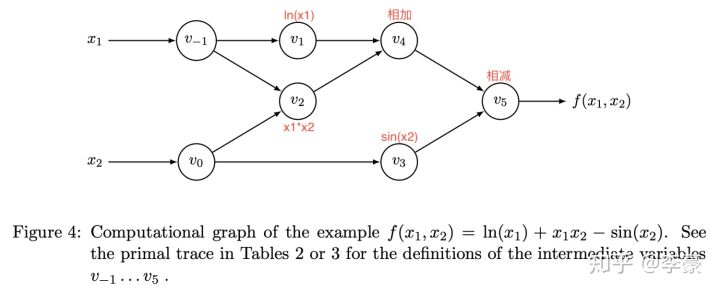
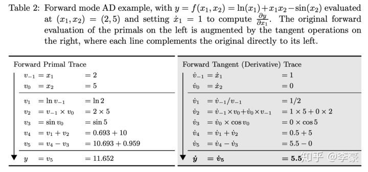
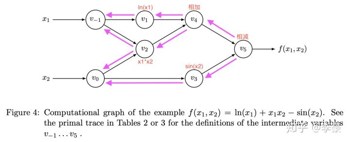
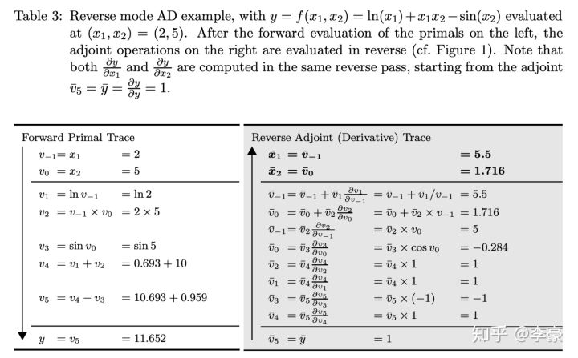

# 自动微分(Automatic Differentiation)

通常的计算微分的方法有：手动计算微分，数值微分法，符号微分法，自动微分法。

+ 手动计算微分需要我们每次手动计算出求导公式后写代码，多数情况下我们写不出来。。。
+ 数值微分法是根据微分的极限定义形式进行计算，计算量过大而且会产成一些舍入、精度上的问题。
+ 符号微分法(`sympy`库使用)将常见的求导公式写成固有函数，直接调用，在此基础上基于链式法则求导，但是实际上这样子的微分计算公式极其复杂，计算量庞大，仅仅是理论上可行，实际基本不用。

在实践中我们采用了自动微分的方法。现在的机器学习、深度学习框架都是使用的自动微分，**而==自动微分法的实质就是计算图==。**不管是tensorflow还是pytorch，我们**建立的计算图最本质的作用就是进行微分，求梯度。**

自动微分法使用计算图，实际上结合了“数值微分”和“符号微分”的长处，**对于已知函数直接采用数值微分法求取微分，并作为中间结果保存; 对于组合函数采用符号微分法将公式展开，并将上一步数值微分的中间结果代入，二者的结合降低了求解和计算的复杂度。**

## 一、前向微分(Forward-Mode Differentiation)

比如，计算函数$f(x_1,x_2)=\ln(x_1)+x_1x_2-\sin(x_2)$的微分：

将上述公式转换为计算图：

上面的每个圆圈表示操作产生的中间结果，下标顺序表示它们的计算顺序，根据计算图来一步步地计算函数的值，如下表所是，其中左侧表示数值计算的过程，右侧表示梯度计算过程：

表中计算了函数在$(2,5)$这一点的函数值和$x_1$的偏导数，整个计算过程结合上图理解。

这种计算偏导(微分)的方法称作前向微分，因为是从输入参数开始推导最后的偏导，不过**缺点很明显，每一次计算相应的输入参数的偏导，就需要将这个偏导数的计算流程再执行一遍，效率很低。**

在此基础上，提出了基于链式法则的反向传播(**Backpropagation， BP**)算法(反向微分)，可以一次性求出每一个输入参数的偏导，用于快速求导，时间效率高。

## 二、反向微分(Reverse-Mode Differentiation)

**反向微分是基于链式法则的，计算复合函数的偏导，其计算顺序就是反向的**：

计算反向微分的表格如下：

**反向微分的好处是一次可以计算出所有输入参数的偏导数。**

> 上面的这个过程实际上就是各个深度学习框架的计算图的反向传播算法的实现原理。

