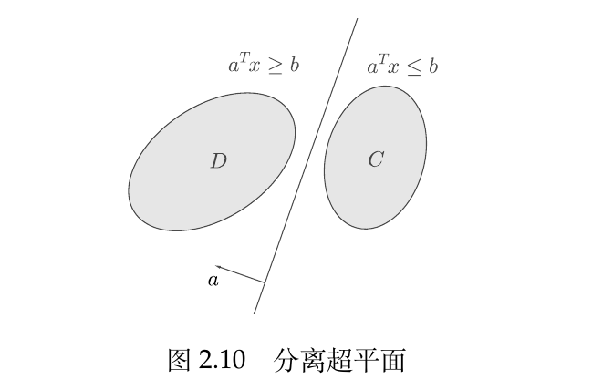

# 凸集

## 一、凸集的定义

对$R^n$中的两个点$x_1\neq x_2$，形如:
$$
y=\theta x_1+(1-\theta)x_2
$$
的点形成了过点$x_1,x_2$的**直线**，当$0\le \theta \le 1$时，这样的点形成了连接点$x_1$与$x_2$的**线段**。

如果连接集合$C$中任意两点的线段都在$C$内，则称$C$为**凸集**，即：
$$
x_1,x_2\in C\Rightarrow\theta x_1+(1-\theta)x_2\in C,\forall \;0\le \theta\le 1
$$

> **仿射集**：
>
> 如果过集合$C$中任意两点的直线都在$C$内，则称$C$为仿射集，即：
> $$
> x_1,x_2\in C \Rightarrow \theta x_1+(1-\theta)x_2\in C,\forall \; \theta \in R
> $$
> **显然，仿射集都是凸集。**

## 二、凸组合与凸包

由凸集可以引出凸组合和凸包的概念。

**凸组合**：形如：
$$
x=\theta_1x_1+\theta_2x+...+\theta_kx_k\\
1=\theta_1+\theta_2+...+\theta_k,\; \theta_i\ge 0,i=1,2,...k
$$
的点称为$x_1,x_2,...x_k$的凸组合。

**凸包**：集合$S$中点所有可能的凸组合构成的集合称作$S$的凸包，记做$\boldsymbol{\mathrm{conv}}S=\{x|x=\sum\limits_{i=1}^k\theta_ix_i,\; x_i\in S, \sum\limits_{i=1}^k\theta_i=1，\theta_i\ge0\}$。

**==$\boldsymbol{\mathrm{conv}}S$是包含$S$的最小的凸集==**。

若在凸组合的定义中去掉$\theta_i\ge0$的限制，我们可以得到**仿射包**：

**仿射包**：设$S\subseteq R^n$，$\boldsymbol{\mathrm{affine}}S=\{x|x=\sum\limits_{i=1}^k\theta_ix_i,\; x_i\in S, \sum\limits_{i=1}^k\theta_i=1\}$。

**一个集合的仿射包实际上是包含该集合的最小仿射集。**

## 三、一些重要的凸集

### 1.超平面和半空间

**超平面**：取任意非零向量$\boldsymbol{x}$，形如$\{\boldsymbol{x}|\boldsymbol{a}^T\boldsymbol{x}=\boldsymbol{b}\}$的集合称为超平面。

**半空间**：取任意非零向量$\boldsymbol{x}$，形如$\{\boldsymbol{x}|\boldsymbol{a}^T\boldsymbol{x}\le\boldsymbol{b}\}$的集合称为半空间。

显然，超平面和半空间都是凸集，但是超平面是仿射集，半空间不是仿射集。

### 2.球、椭球、锥

**球**：球是空间中到某个点距离(或者两者差的范数)小于某个常数的点的集合：
$$
B(\boldsymbol{x_c},\boldsymbol{r})=\{\boldsymbol{x}\; \Big{|}\;||\boldsymbol{x}-\boldsymbol{x_c}||_p\le r\}=\{\boldsymbol{x_c}+r\boldsymbol{u}\; \Big{|}\; ||u||_p\le 1\}
$$
**椭球**：形如
$$
\{\boldsymbol{x}\;\Big{|}\; (\boldsymbol{x}-\boldsymbol{x_c})^TP^{-1}(\boldsymbol{x}-\boldsymbol{x_c})\le 1\}
$$
的集合称为椭球，其中$P\in S^n_{++}$，即**==$P$对称正定==**。

椭球的另一种表示为$\{\boldsymbol{x_c}+A\boldsymbol{u}\;\Big{|}\; ||u||_p\le1\}$，$A$为非奇异的方阵。

**锥**：形如：
$$
\{(\boldsymbol{x},t)\;\Big{|}\; ||\boldsymbol{x}||_p\le t\}
$$
的集合称为锥。

### 3.多面体

满足线性等式和不等式组的集合称为多面体，即：
$$
\{\boldsymbol{x}\;\Big{|}\; A\boldsymbol{x}\le \boldsymbol{b},\; C\boldsymbol{x}=0,A\in R^n,\;C\in R^n\}
$$
**多面体是有限个半空间和超平面的交集，因此是凸集。**

### 4.(半)正定锥

记$S^n$是$n\times n$对称矩阵的集合，$S^n_{+}=\{X\in S^n\;\Big{|}\; X\ge 0\}$为$n\times n$半正定矩阵的集合，$S^n_{++}=\{X\in S^n\;\Big{|}\; X> 0\}$为$n\times n$正定矩阵的集合。

## 四、保凸的运算(凸集的性质)

1. **定理1**：任意多个凸集的交为凸集，即若$C_i,i \in I$是凸集，那么，$\mathop{\cap}\limits_{i\in I}C_i$为凸集。

2. **定理2**：设$f:R^n\rightarrow R^m$是仿射变换$f(x)=Ax+b,A\in R^{m\times n},b\in R^m$，则：

   + 凸集在$f$下的像是凸集。
   + 凸集在$f$下的原像是凸集。

   > 缩放、平移、投影变换都是仿射变换，因此，凸集经过缩放、平移或投影的像仍是凸集。

## 五、分离超平面定理、支撑超平面定理

**可以用超平面分离不相交的凸集。**

### 1.分离超平面定理

如果$C$和$D$是不相交的两个凸集，则存在非零向量$\boldsymbol{a}$和常数b，使得
$$
\boldsymbol{a}^T\boldsymbol{x}\le b,\; \forall \boldsymbol{x}\in C,且\boldsymbol{a}^T\boldsymbol{x}\ge b,\forall \boldsymbol{x}\in D
$$
即超平面$\{\boldsymbol{x}\;\Big{|}\; \boldsymbol{a}^T\boldsymbol{x}=b\}$分离了$C$和$D$。

### 2.严格分离定理

设$C$是闭凸集，D是单点集时，有严格分离定理：

点$x_0\in C$，则存在非零向量$\boldsymbol{x}$和常数b，使得：
$$
\boldsymbol{a}^T\boldsymbol{x}< b,\forall \boldsymbol{x}\in C且\boldsymbol{a}^T\boldsymbol{x_0}>b
$$
严格分离定理要求点$\boldsymbol{x_0}\notin C$，**当点$\boldsymbol{x_0}$恰好在凸集$C$的边界上时，可以构造支撑超平面。**

### 3.支撑超平面定理

**支撑超平面**：给定集合C及其边界上一点$\boldsymbol{x_0}$，如果$\boldsymbol{a}\neq 0$满足$\boldsymbol{a}^T\boldsymbol{x}\le \boldsymbol{a}^T\boldsymbol{x_0},\forall \boldsymbol{x}\in C$，那么称集合$\{\boldsymbol{x}\;\Big{|}\; \boldsymbol{a}^T\boldsymbol{x}=\boldsymbol{a}^T\boldsymbol{x_0}\}$为C在边界点$\boldsymbol{x_0}$处的支撑超平面。

**支撑超平面定理**：如果C是凸集，则在C的任意边界点处都存在支撑超平面。

> 支撑超平面的几何直观理解：给定一个平面之后，**可以把凸集边界上的任意一点当成支撑点将凸集放置在该平面上。**

