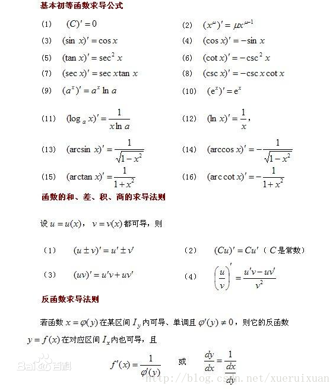

# 导数的定义与意义

## 一、微分

对函数$y=f(x)$定义域中的一点$x_0$，若只存在一个只与$x_0$有关而与$\triangle x$无关的数$g(x_0)$，使得当$\triangle x\rightarrow 0$时恒成立关系式：
$$
\triangle y=g(x_0)\triangle x+o(\triangle x)
$$
则称$f(x)$在$x_0$处的微分存在，或称$f(x)$在$x_0$处可微。

若函数$y=f(x)$在某一区间上的每一个点都可微，则称$f(x)$在该区间上可微。

当$f(x)$在x处是可微的，且$\triangle x\rightarrow 0$时，我们将$\triangle x$称为自变量的微分，记做$\mathrm{d}x$，而$\triangle y$的线性主要部分$g(x)\mathrm{d}x$称为因变量的微分，记做$\mathrm{d}y$或$\mathrm{d}f(x)$，即：
$$
\mathrm{d}y=g(x)\mathrm{d}x
$$

## 二、导数

若函数$y=f(x)$在其定义域中的一点$x_0$处极限$\lim\limits_{\triangle x\rightarrow 0}\frac{\triangle y}{\triangle x}=\lim\limits_{\triangle x\rightarrow 0}\frac{f(x_0+\triangle x)-f(x_0)}{\triangle x}$存在，则称$f(x)$在$x_0$处可导，并称这个极限值为$f(x)$在$x_0$处的导数，记为$f^{'}(x_0)$。

> 定理：函数$f(x)$在x处可微的充要条件是$f(x)$在x处可导。

**导数实际上就是变化率，在机器学习中的偏导数实际上是在各个坐标轴上的变化率。**

## 三、常用函数的导数公式

## 四、复合函数求导链式法则

$$
(f[g[x]])'=f'[g(x)]g'(x)
$$

## 五、函数的单调性

对于在$[a,b]$连续，$(a,b)$可导的函数$f(x)$，对$\forall x_0\in(a,b)$：

+ $f'(x_0)\ge0$则函数在$(a,b)$单调递增。
+ $f'(x_0)\le 0$则函数在$(a,b)$单调递减。

> 神经网络的激活函数需要研究函数的单调性，AdaBoost算法也需要。

## 六、函数的极值

### 1.极值点判定定理

设函数$f(x)$在$x_0$点的某一邻域内有定义，且$f(x)$在$x_0$点连续：

1. 设存在$\delta>0$，使得$f(x)$在$(x_0-\delta, x_0)$与$(x_0,x_0+\delta)$上可导。

   + 若在$(x_0-\delta,x_0)$上有$f'(x)\ge 0$，在$(x_0,x_0+\delta)$上有$f'(x)\le 0$，则$x_0$是$f(x)$的极大值点。
   + 若在$(x_0-\delta,x_0)$上有$f'(x)\le 0$，在$(x_0,x_0+\delta)$上有$f'(x)\ge 0$，则$x_0$是$f(x)$的极小值点。
   + 若在$(x_0-\delta,x_0)$上和在$(x_0,x_0+\delta)$上$f'(x)$同号，则$x_0$不是$f(x)$的极值点。

2. 设$f'(x_0)=0$，且$f(x)$在$x_0$点二阶可导。

   + 若$f''(x_0)<0$，则$x_0$是$f(x)$的极大值点;
   + 若$f''(x_0)>0$，则$x_0$是$f(x)$的极小值点;
   + 若$f''(x_0)=0$，则$x_0$可能是$f(x)$的极值点，也可能不是极值点。

> 因为在机器学习中，大部分优化问题都是连续优化问题，因此通过计算极值点求解优化问题，通常是实现最小化损失函数，最大化似然函数等目标，不过几乎所有优化问题必然会求导，这段就跟废话一样。。。

