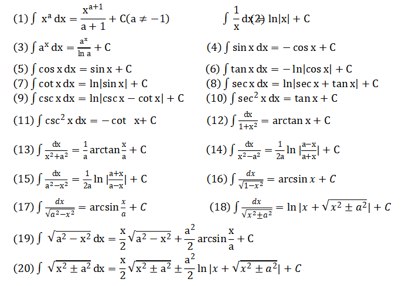

# 不定积分与定积分

定积分、变上限积分主要用于设计对概率密度函数进行积分的概率计算中，比如机器学习中的朴素贝叶斯分类器，概率图模型等概率型算法。

## 一、不定积分

积分就是微分的逆运算，常用的积分公式：

## 二、换元积分法与分部积分法

### 1.换元积分法

#### (1)第一类换元积分法

$$
\int f(x)\mathrm{d}x=\int\tilde{f}(g(x))g'(x)\mathrm{d}x=\int\tilde{f}(g(x))\mathrm{d}g(x)=\int\tilde{f}(u)\mathrm{d}u=\tilde{F}(u)+C=\tilde{F}(g(x))+C
$$

#### (2)第二类换元积分法

$$
\int f(x)\mathrm{d}x=\int f(\psi(t))\mathrm{d}\psi(t)=\int f(\psi(t))\psi'(t)\mathrm{d}t=\tilde{F}(t)+C=\tilde{F}(\psi^{-1}(x))+C
$$

### 2.分部积分法

分部积分法的理论基础是函数乘积的微分公式。

对任意两个可微函数$u(x),v(x)$，成立关系式：
$$
\mathrm{d}[u(x)v(x)]=v(x)\mathrm{d}[u(x)]+u(x)\mathrm{d}[v(x)]
$$
两边同时求不定积分：
$$
u(x)v(x)=\int v(x)\mathrm{d}[u(x)]+\int u(x)\mathrm{d}[v(x)]
$$
移项：
$$
\int u(x)\mathrm{d}[v(x)]=u(x)v(x)-\int v(x)\mathrm{d}[u(x)]\\
\int u(x)v'(x)\mathrm{d}x=u(x)v(x)-\int v(x)u'(x)\mathrm{d}x
$$
这就是分部积分公式。

> 这部分只是回忆一下，有些算法的推导会用到，而Python的Scipy库实现了计算定积分的函数。

## 三、定积分

根据不定积分求就可以了。

## 四、Newton-Leibniz公式

$$
\int_a^bf(x)\mathrm{d}x=F(x)|^b_a
$$

