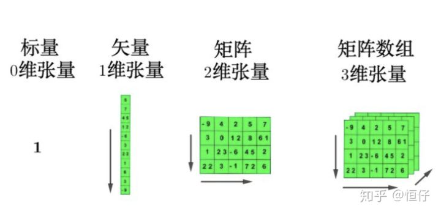
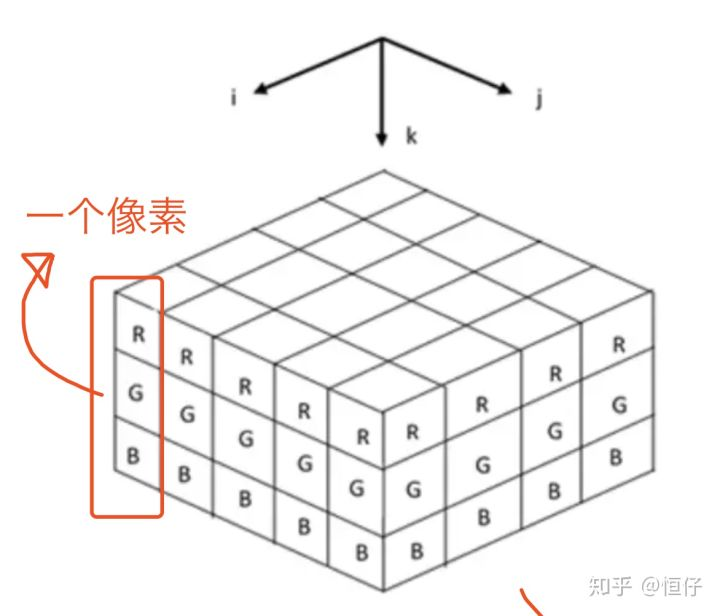

# 标量、向量、矩阵和张量

## 一、标量(scalar)

标量就是单独的数字。

## 二、向量(vector)

向量就是一列数字$\boldsymbol{x}=[x_1,x_2,...,x_n]^T$，或：
$$
\boldsymbol{x}=\left[
\begin{matrix}
x_1\\
x_2\\
\vdots\\
x_n
\end{matrix}
\right]
$$
其中$x_i\in R$。

## 三、矩阵(matrix)

矩阵$A_{m\times n}$是一个$m \times n$的数排成的m行n列的表格：
$$
\left[
\begin{matrix}
a_{11} & a_{12} & \cdots & a_{1n}\\
a_{21} & a_{22} & \cdots & a_{2n}\\
\vdots & \vdots & \ddots & \vdots\\
a_{m1} & a_{m2} & \cdots & a_{mn}
\end{matrix}
\right]
$$
如果$m = n$，则称为n阶方阵。

## 四、张量(tensor)

**张量是多维数组**。一个数组中的元素分布在若干维坐标的规则网格之中。

贴一张图片方便理解：

> 注意：千万不要把张量的维度和矩阵的维度混淆！！！
>
> **我们通常说的矩阵的维度是指矩阵的$(行数 \times 列数)$，即$A_{m\times n}$是$m \times n$维的。**

举个例子:

彩色图像文件(RGB)，一般都会处理成3-d tensor，每个2d array中的element表示一个像素。

在python中的tensor对象通常会有三个属性：

+ rank: tensor的维度。
+ shape：tensor的行、列大小。
+  type：tensor的元素的数据类型。

