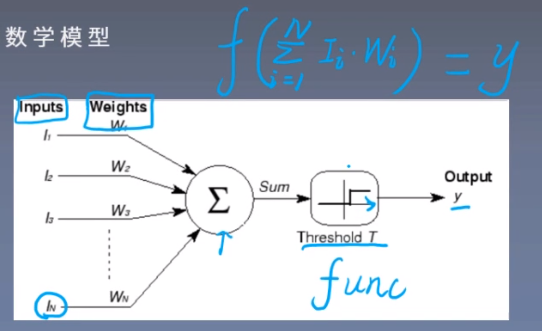

# 人工神经元(Artificial Neural Unit)

人工神经元是从人类神经元中抽象出来的数学模型。

设输入为$(I_1,I_2,...,I_N)$，权值向量为$(W_1,W_2,...,W_N)$，则人工神经元的数学公式为：
$$
y = f(\sum_{i=1}^NI_iW_i)
$$
这里的$f$是激活函数。

> **人工神经网络**：大量神经元以某种连接方式构成的机器学习模型。

