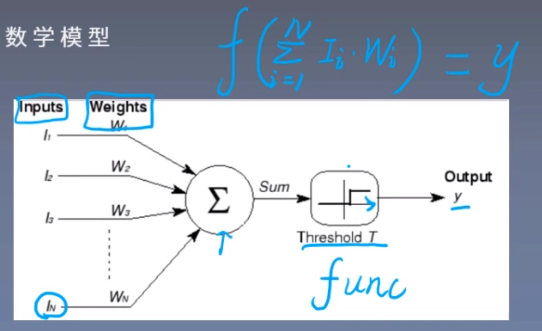
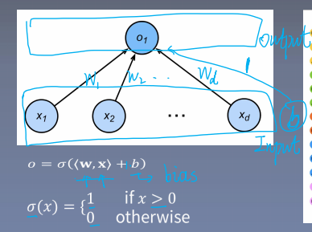
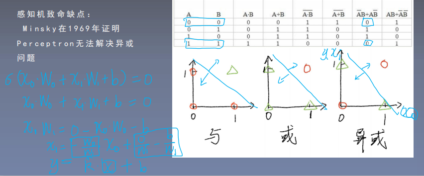

# 人工神经元与感知机

## 1.人工神经元(Artificial Neural Unit)

人工神经元是从人类神经元中抽象出来的数学模型。

设输入为$(I_1,I_2,...,I_N)$，权值向量为$(W_1,W_2,...,W_N)$，则人工神经元的数学公式为：
$$
y = f(\sum_{i=1}^NI_iW_i)
$$
这里的$f$是激活函数。

> **人工神经网络**：大量神经元以某种连接方式构成的机器学习模型。

### 2.感知机(perceptron)

第一个神经网络：感知机(perceptron)。

感知机的数学模型：
$$
output = \sigma(\boldsymbol{w}\cdot \boldsymbol{x}+b)
$$
其中,$\boldsymbol{x}$为输入向量。$\boldsymbol{w}$为权值向量，$b$为偏置(bias)，$\sigma$为激活函数(下面是激活函数的一种)。
$$
\sigma(x)=\left\{
\begin{matrix}
1\quad &x > 0\\
0\quad &otherwise
\end{matrix}
\right.
$$
**感知机可以用来解决二分类问题，但是可以证明，感知机无法解决异或问题。**

