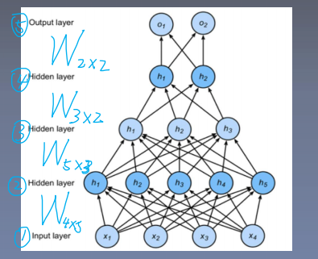

# 多层感知机(Multi-layer Perceptron，MLP)

**多层感知机**(Multi-layer Perceptron，MLP)：在单层感知机神经网络网络基础上引入一个或多个**隐藏层**。

**多层感知机的前向传播**：
$$
\sigma(X_{1\times4}\cdot W_{4\times 5})=H_{1\times 5}\\
\sigma(H_{1\times5}\cdot W_{5\times 3})=H_{1\times 3}\\
\sigma(H_{1\times3}\cdot W_{3\times 2})=H_{1\times2}\\
\sigma(H_{1\times2}\cdot W_{2\times 2})=O_{1\times2}
$$
**多层感知机的激活函数**：

**==没有激活函数的话，网络退化成单层网络：==**
$$
H=XW_h+b_h\\
O=HW_o+b_o=XW_hX_o+b_hW_o+b_o=(XW_hX_o)+(b_hW_o+b_o)
$$
**==隐藏层加入激活函数，可以避免网络退化。==**

