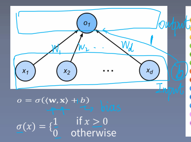
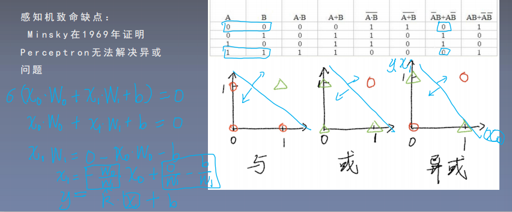

# 多层感知机(Perceptron)

第一个神经网络：感知机(perceptron)。

感知机的数学模型：
$$
output = \sigma(\boldsymbol{w}\cdot \boldsymbol{x}+b)
$$
其中,$\boldsymbol{x}$为输入向量。$\boldsymbol{w}$为权值向量，$b$为偏置(bias)，$\sigma$为激活函数(下面是激活函数的一种)。
$$
\sigma(x)=\left\{
\begin{matrix}
1\quad &x > 0\\
0\quad &otherwise
\end{matrix}
\right.
$$
**感知机可以用来解决二分类问题，但是可以证明，感知机无法解决异或问题。**

