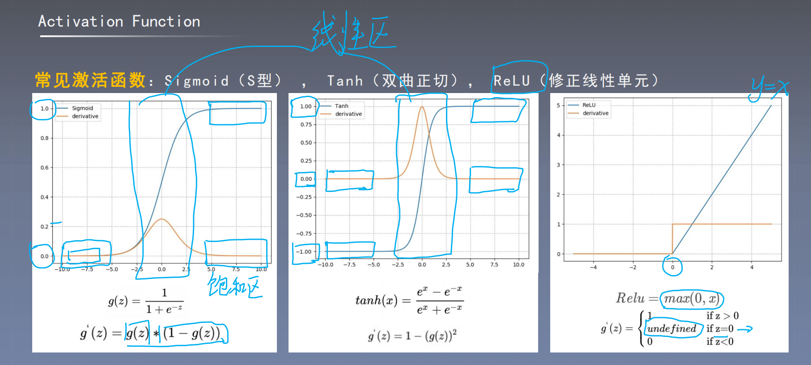

# 激活函数(Activation Function)

## 一、激活函数的作用

1. 如果没有激活函数，那么网络退化为单层网络。在隐藏层加入激活函数，可避免网络退化。

   > 让多层感知机成为真正的多层，否则等价于一层。
   >
   > **==没有激活函数的话，网络退化成单层网络：==**
   > $$
   > H=XW_h+b_h\\
   > O=HW_o+b_o=XW_hX_o+b_hW_o+b_o=(XW_hX_o)+(b_hW_o+b_o)
   > $$

2. 引入非线性，使**网络可以逼近任意非线性函数**(通用逼近定理， universal approximator)。

## 二、激活函数需要的性质

1. **连续并可导(允许少数点上不可导)**，便于利用数值优化的方法来学习网络参数(反向传播算法就是用来求偏微分的)。
2. 激活函数及其导函数要尽可能的**简单**，有利于提高网络计算效率。
3. 激活函数的导函数的**值域要在合适的区间内**，不能太大也不能太小，否则会影响训练的效率和稳定性。

## 三、常见的激活函数

常见的激活函数：Sigmod(S型)，Tanh(双曲正切)，ReLU(非线性修正单元)等。

其中，Sigmod，Tanh激活函数是**饱和激活函数**，因为到两侧，其导数趋近于0，导致效率下降严重。

ReLU激活函数是**非饱和激活函数**，但是ReLU需要注意0的处理。

> ReLU因为没有饱和区，所以是CNN中使用最多的。
>
> Tanh适合均值为0的分布。

