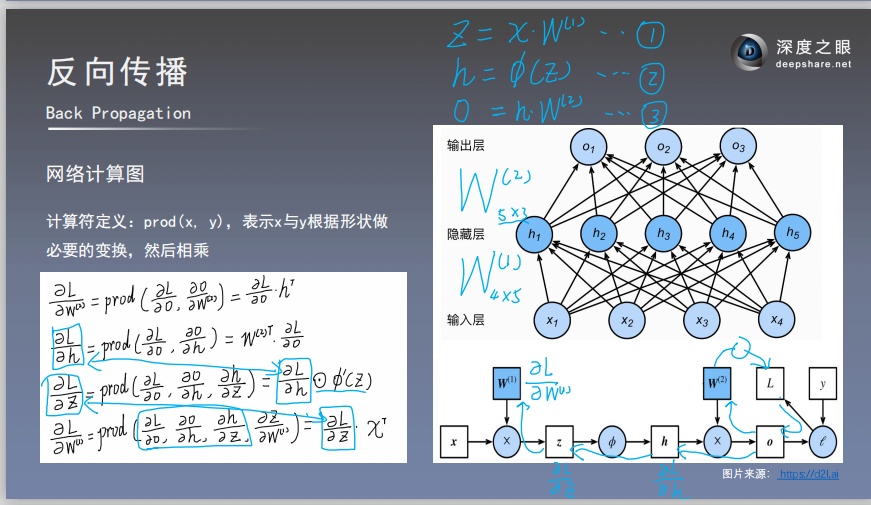
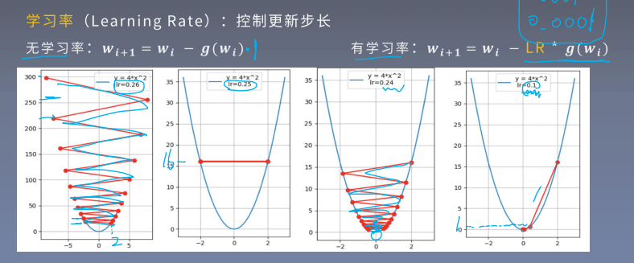

# 反向传播(Back Propagation)

## 一、反向传播

1. **前向传播**：输入层**数据**开始从前向后，数据逐步传递至输出层。

2. **反向传播**：**损失函数**开始从后向前，**梯度**逐步传递至第一层。

3. 反向传播**作用**：用于**权重更新**，使网络输出更接近标签。

4. **损失函数**：**衡量模型输出与真实标签的差异,** $Loss=f(\hat{y},y)$。

## 二、反向传播的原理：计算图与链式求导法则

反向传播原理：微积分中的**链式求导法则**，可以用来求导，求偏微分。因此，**反向传播基于计算图的结构。**

> 链式求导法则在神经网络中会涉及向量值函数求导，其结果为Jaccobian矩阵，但是其算子形式也是符合链式求导法则的。

**计算图对神经网络及其重要，也是反向传播算法的基础。**

## 三、梯度下降法(gradient decent)

1. **梯度下降**法(gradient decent):权值**沿梯度负方向更新**，使函数值减小。

2. **学习率**(learning rate)：控制更新步长。

   沿梯度负方向更新：$w_{i+1}=w_i-\alpha g(w_i)$ ，其中，$\alpha$是学习率，一般而言$0<\alpha<1$。

   如果学习率过大，那么可能会无法收敛; 如果学习率过小，那么收敛速率会很慢。

   

