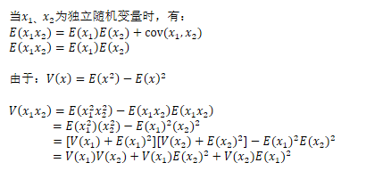

# 权值初始化(Weight Initialization)

## 一、权值初始化

1. **权值初始化**：训练前对权值参数赋值，良好的权值初始化有利于模型训练。

   > **将所有W初始化为0是错误的**。因为如果所有的参数都是0，那么所有神经元的输出都将是相同的，那在back propagation的时候同一层内所有神经元的行为也是相同的 --- gradient相同，weight update也相同。这显然是一个不可接受的结果。

2. **随机初始化法**：高斯分布随机初始化，从高斯分布中随机采样，对权重进行赋值。

   > 权重不能太大，也不能太小。

3. **自适应标准差**：自适应方法随机分布中的标准差。

   较好的自适应标准差方法有：Xavier初始化，He初始化，Kaiming初始化(MSRA)等。

## 二、Xavier初始化

1. Xavier初始化的思想：**为了使得网络中信息更好的流动，每一层输出的方差应该尽量相等。**

   > 在Xavier论文中，作者给出的**==Glorot条件==**是：
   >
   > + 正向传播时，**==激活值的方差==**保持不变；
   > + 反向传播时，关于状态值的**==梯度的方差==**保持不变。

   因此，Xavier需要考虑输入神经元的个数与输出神经元的个数。

2. Xavier初始化近似为均匀分布：
   $$
   W\sim U[-\sqrt{\frac{6}{n_j+n_{j+1}}},\sqrt{\frac{6}{n_j+n_{j+1}}}]
   $$
   $n_j$是输入神经元的个数，$n_{j+1}$是输出神经元的个数。

3. 证明：

   两个随机变量乘积的方差展开式：
   $$
   Var(w_ix_i)=E[w_i]^2Var(x_i)+E[x_i]^2Var(w_i)+Var(w_i)Var(x_i)
   $$

   >证明过程：
   >
   >

   假设$E(x_i)=E(w_i)=0$ (可以通过BN来满足)，则有：
   $$
   Var(y)=\sum_{i=1}^nVar(x_i)Var(w_i)
   $$
   若随机变量$x_i,w_i$满足独立同分布：
   $$
   Var(y)=\sum_{i=1}^nVar(x_i)Var(w_i)=nVar(x)Var(w)
   $$
   为了满足每一层的方差尽可能相等，即$Var(y)=Var(x)$，那么只能让$Var(w)=\frac{1}{n}$。

   但是，正向传播时从前向后计算，$Var(w)=\frac{1}{n_{in}}$，反向传播时从后向前计算，$Var(w)=\frac{1}{n_{out}}$

   ，但是输入与输出的神经元个数往往不等，那么取平均值，即：
   $$
   Var(w)=\frac{2}{n_{in}+n_{out}}
   $$
   设$w$为均匀分布，根据均匀分布的方差公式$\frac{(b-a)^2}{12}$，可以计算出：
   $$
   w\sim U[-\sqrt{\frac{6}{n_{in}+n_{out}}},\sqrt{\frac{6}{n_{in}+n_{out}}}]
   $$

> Xavier初始化方法适用的激活函数有限：**关于0对称；线性**。而ReLU激活函数并不满足这些条件。

## 三、He  initialization

He initialization的思想是：在ReLU网络中，假定每一层有一半的神经元被激活，另一半为0，所以，要保持variance不变，只需要在Xavier的基础上再除以2。

> He initialization非常适合ReLU网络。

## 四、Kaiming initialization

