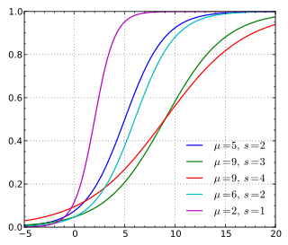
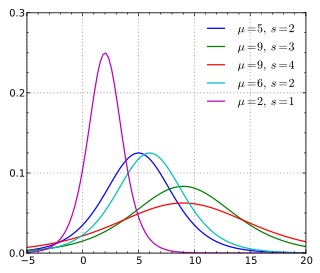

# Logistic回归模型

Logistic回归模型属于对数线性模型。

# 一、Logistic distribution

1. **Logistic分布**：设X是连续随机变量，X服从Logistic分布是指X具有下列分布函数和密度函数：
   $$
   F(x)=P(X\le x)=\frac{1}{1-e^{-\frac{(x-\mu)}{\gamma}}}\\
   f(x)=F'(x)=\frac{e^{-\frac{(x-\mu)}{\gamma}}}{\gamma(1+e^{-\frac{(x-\mu)}{\gamma}})^2}
   $$
   其中，$\mu$是位置参数，$\gamma>0$是形状参数。

   2. Logistic分布的分布函数：

   

   Logistic分布的分布函数以$(\mu,\frac{1}{2})$为中心对称，即满足
   $$
   F(-x+\mu)-\frac{1}{2}=-F(x+\mu)+\frac{1}{2}
   $$
   曲线在中心附近增长速度较快，在两端增长速度较慢，形状参数$\gamma$越小，曲线在中心附近增长越快，这一点可以通过密度函数图像看出来。

   3. Logistic分布的密度函数：

   

## 二、二项Logistic回归模型

1. 二项Logistic回归模型(binomial logistic regression model)是一种分类模型，由条件概率分布$P(Y|X)$表示，形式为参数化的Logistic分布。

2. **二项Logistic回归模型**：二项Logistic回归模型是如下的条件概率分布：
   $$
   P(Y=1|x)=\frac{e^{w.x+b}}{1+e^{w.x+b}}\\
   P(Y=0|x)=\frac{1}{1+e^{w.x+b}}
   $$
   这里，$x\in R^n$是输入，$Y\in\{0,1\}$是输出，$w\in R^n$和$b\in R$是参数，$w$称为权值向量，$b$称为偏置，$w.x$为$w$和$x$的内积。

3. 对于给定的输入实例，求得$P(Y=1|x),P(Y=0|x)$，比较两个条件概率值的大小，将实例x分为概率值较大的那一类。

4. **事件的几率(odds)**：事件的几率是指该事件发生的概率与该事件不发生的概率的比值。如果事件发生的概率是p，那么该事件的几率是$\frac{p}{1-p}$，该事件的对数几率(log odds)或logit函数是：$logit(p)=\log\frac{p}{1-p}$。

5. 对Logistic回归而言：
   $$
   \log \frac{P(Y=1|x)}{1-P(Y=1|x)}=\log e^{w.x+b}=w.x+b
   $$
   这就是说，**在Logistic回归模型中，输出Y=1的对数几率是输入x的线性函数**。或者说，输出Y=1的对数几率是由输入x的线性函数表示的模型。

## 三、模型参数估计

1. Logistic回归模型学习时，对于给定的训练数据集$T=\{(x_1,y_1),(x_2,y_2),...(x_N,y_N)\}$，其中，$x_i\in R^n，y\in\{0,1\}$，可以应用极大似然估计法估计模型参数。

2. 设$P(Y=1|x)=\pi(x),P(Y=0|x)=1-\pi(x)$，似然函数为：
   $$
   \prod_{i=1}^N[\pi(x_i)]^{y_i}[1-\pi(x_i)]^{1-y_i}
   $$
   对数似然函数为：
   $$
   L(w)=\sum_{i=1}^N[y_i\log\pi(x_i)+(1-y_i)\log{(1-\pi(x_i))}]\\
   =\sum_{i=1}^N[y_i\log{\frac{\pi(x_i)}{1-\pi(x_i)}}+\log(1-\pi(x_i))]\\
   =\sum_{i=1}^N[y_i(w.x_i)-\log(1+e^{w.x_i})]
   $$

   > 这里省略了偏置b

   对$L(w)$求极大值，得到$w$的估计值。

3. 问题就变成了以对数似然函数为目标函数的最优化问题，Logistic回归学习中通常采用的方法是梯度下降法以及拟牛顿法。

### 四、多项Logistic回归

1. 多项Logistic回归模型(multi-nomial logistic regression model)，用于多类分类。假设离散型随机变量Y的取值集合是$\{1,2,...,K\}$，那么多项式Logistic回归的模型是：
   $$
   P(Y=k|x)=\frac{e^{w_k.x}}{1+\sum_{k=1}^{K-1}e^{w_k.x}},k=1,2,...,K-1\\
   P(Y=K|x)=\frac{1}{1+\sum_{k=1}^{K-1}e^{w_l.x}}
   $$
   这里，$x\in R^{n+1},w_k\in R^{n+1}$。

2. 二项Logistic回归的参数估计也可以推广到多项Logistic回归。

